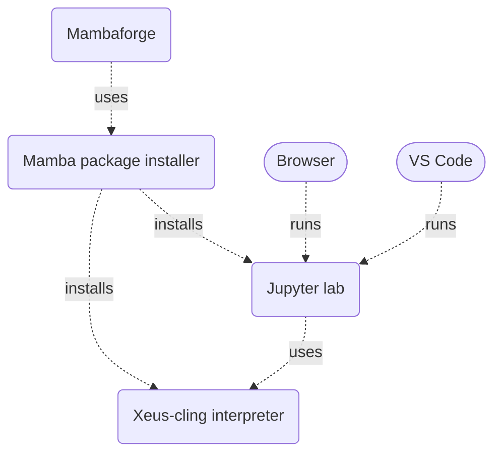

In this tutorial, I will guide you through the process of starting your C++ journey on Jupyter Notebook. By the end, you will effortlessly run C++ notebooks, seamlessly switching between VS Code and your browser for a smooth coding experience. Let's dive in!

The whole process is summarized below:

## Prerequisites
- WSL or Linux. (I will be using WSL 2 running Ubuntu)
- VS Code
- wget

## Why mambaforge
> Mambaforge is a cross-platform package manager. It uses the `mamba`  package manager.
{: .prompt-tip }

I decided to use the Mambaforge package installer rather than Miniconda or Anaconda for the following reasons:

- Anaconda installs too many packages by default.
- The package manager `mamba` is faster than the `conda` package manager in Miniconda.
- I ran into a lot of issues with Miniconda:
    - Unable to update conda ([Github issue](https://github.com/conda/conda/issues/6941)) 
    - Unable to install xeus-cling: 
    ```bash
    ○ conda install xeus-cling jupyterlab -c conda-forge
Collecting package metadata (current_repodata.json): done
Solving environment: failed with initial frozen solve. Retrying with flexible solve.
Solving environment: failed with repodata from current_repodata.json, will retry with next repodata source.
Collecting package metadata (repodata.json): done
Solving environment: failed with initial frozen solve. Retrying with flexible solve.
    ```
    If you have faced the same issues then this tutorial might help you.

## Download Mambaforge installer

Go to the [mambaforge repository](https://github.com/conda-forge/miniforge#mambaforge) and copy the download link for the latest **Mambaforge** installer for your OS.


_Since I am using WSL, I chose the copied the first download link._

> On the [mambaforge repository](https://github.com/conda-forge/miniforge#mambaforge), be careful not to confuse between Mambaforge and Miniforge installers.
{: .prompt-warning }

 In the root directory of your terminal, run
```bash
wget https://github.com/conda-forge/miniforge/releases/latest/download/Mambaforge-pypy3-Linux-x86_64.sh
```
>The download link I used may be outdated. Replace my link with the updated link from the github repository.
{: .prompt-warning }

## Install Mambaforge

Find the name of the downloaded file using `ls`. In my case, the name of the installer is `Mambaforge-Linux-x86_64.sh`. Now install Mambaforge:
```bash
sh ./Mambaforge-Linux-x86_64.sh
```
You will have to accept the license terms of Mambaforge. Press `q` to skip to the end of the license instead of pressing `ENTER` repeatedly.
```
Do you accept the license terms? [yes|no]
[no] >>> yes

Mambaforge will now be installed into this location:
/home/mcl/mambaforge

  - Press ENTER to confirm the location
  - Press CTRL-C to abort the installation
  - Or specify a different location below

[/home/mcl/mambaforge] >>>
```
Install at the location given by Mambaforge. You will also be asked to initialize Mambaforge. Accept everything.

Restart your terminal when everything is done. You should find a new folder Mambaforge in your root directory. You will also see that you are currently in the `base` environment.

Run `mamba --version` to verify that everything was installed:

```bash
mamba 1.4.1
conda 23.1.0
```
Your versions might be different but it is not an issue as long as you are using the latest versions.

> If you want to get rid of Mambaforge permanently, follow these [instructions](https://github.com/conda-forge/miniforge#uninstallation).
{: .prompt-danger }

## Install xeus-cling

xeus-cling is a Jupyter kernel for C++ available on WSL 2 and Linux but **not on Windows at the time being**. The latest instructions on how to install xeus-cling can be found [on their github repository](https://github.com/jupyter-xeus/xeus-cling#installation).

Create an environment named `cling` and activate it:
```bash
mamba create -n cling
source activate cling
```

Then you can install its dependencies:
```bash
mamba install xeus-cling -c conda-forge
```

> The file size of xeus-cling is around 400MB.
{: .prompt-warning }

> If you want to deactivate the environment, run `conda deactivate`.  
{: .prompt-tip }


## Install jupyterlab

> Make sure that the `cling` environment is **activated** before proceeding.
{: .prompt-danger }


```bash
mamba install jupyterlab -c conda-forge
```

>The file size of jupyterlab is around 90MB.
{: .prompt-tip }

## Run notebook in VS Code
Install the Jupyter extension pack and enable it in the Remote Extension Host. The pack should contain the following extensions:
- Jupyter by Microsoft
- Jupyter Keymap by Microsoft
- Jupyter Cell Tags by Microsoft
- Jupyter Notebook Renderers by Microsoft

>To run a C++ notebook in VS Code there’s no need to activate the cling environment.
{: .prompt-tip }

For testing, create a notebook `a.ipynb` on VS Code (or open an existing one).

Click on the `Select Kernel` option in the top right corner.


_Jupyter notebook in VS Code. Click on image to maximize_

Choose `Jupyter Kernel` as kernel source in the dropdown menu that appears. Finally, select the C++ version that you want to use.


_Jupyter notebook in VS Code. Click on image to maximize_

> If you don't see the kernels appearing in the dropdown, I recommend uninstalling the Jupyter extension pack, re-installing them, and restart VS Code.
{: .prompt-warning }

You can write a quick hello world program and execute the cell using `SHIFT` + `ENTER`. 


On the bottom right corner of the cell, you will notice that `Python` is written. This is because Python is the default cell language mode. You can change this if you want by clicking on `Python` and then selecting C++.

> At the time being, formatting c++ code in jupyter notebooks in VS Code is not possible.
{: .prompt-warning }
  
## Run notebook in browser

If you want to run your C++ Jupyter notebook on your browser instead of VS Code, follow these instructions:

After activating the `cling` environment with `source activate cling`, run:
```bash
jupyter notebook --no-browser
```
A similar message will appear:
```output
    To access the notebook, open this file in a browser:
        file:///home/mcl/.local/share/jupyter/runtime/nbserver-13926-open.html
    Or copy and paste one of these URLs:
        http://localhost:8888/?token=b3f2faa815cb120965bcec37b6a08bcec9a23f1b9550ee0f
     or http://127.0.0.1:8888/?token=b3f2faa815cb120965bcec37b6a08bcec9a23f1b9550ee0f

```
Open one of these URLs in your browser. I am using a Chrome browser installed on Windows.


_Jupyter notebook in Chrome browser_