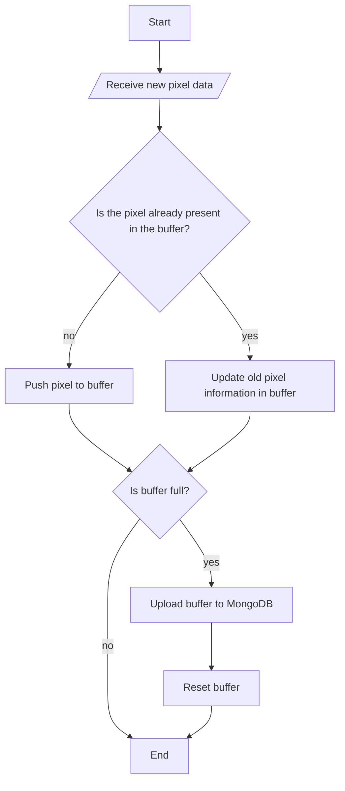

While thinking about how to go about the [Members Only assignment of The Odin Project](https://www.theodinproject.com/lessons/nodejs-members-only), I was inspired to build something similar to [r/place](https://en.wikipedia.org/wiki/R/place), a collaborative canvas where users can draw pixels in real-time. The purpose of this post is to document the design choices I made. I must admit that [Reddit's blog post](https://www.redditinc.com/blog/how-we-built-rplace/) on how they built r/place greatly helped me in my endeavor. 


_Two users side-by-side drawing on art98_

> All the source code for art98 is available on [Github](https://github.com/creme332/art98) under the MIT license and the project is deployed at [https://art98.vercel.app/](https://art98.vercel.app/).
{: .prompt-tip }

## Requirements
- The canvas must have 100x100 pixels.
- Users must be able to zoom and pan the canvas.
- Drawing of pixels must occur in real-time: If one user draws a pixel at one point in time then another user should see the drawn pixel almost instantly (without refreshing the page).
- Users must be able to create an account.
- Users must first login to be able to see the canvas and draw.
- There must be 3 types of users with varying privileges:
 
    |                                                          | `Basic`      | `Premium`      | `Admin`   |
    | -------------------------------------------------------- | ------------ | -------------- | --------- |
    | Number of pixels that can be drawn                       | 5 per minute | 20  per minute | Unlimited |
    | Inspect identity of online users                         | ❌            | ✅              | ✅         |
    | Inspect individual tiles to see who placed them and when | ❌            | ✅              | ✅         |
    | Reset board                                              | ❌            | ❌              | ✅         |
- Users must be able to upgrade/downgrade their account.
- The website should support at least 5 simultaneous users.
- A guest account must be available for users who want to skip registration.


I was not expecting much traffic to a pet project so I figured that a smaller canvas (instead of 1000x1000 pixels like the original r/place) was more appropriate. A smaller canvas also provided additional benefits:
- Creating a database for a 100x100 canvas in MongoDB takes 2-3 minutes while a 1000x1000 canvas will take hours and will slow down development.
- I can easily drop the database and recreate it if needed.
- The canvas will be transmitted faster to clients.


## Data model


My database of choice was MongoDB, a noSQL database similar to the Cassandra database which was used in r/place.


The three most important entities (or models) in the database are illustrated below:


_ERD of database_


_art98 database on MongoAtlas_


> The `sessions` collection was created by the `connect-mongo` library and stores user session information.
{: .prompt-tip }


### User
```js
// sample user document
{
  "_id": {
    "$oid": "6570731cfe67c6ac2c3ff236"
  },
  "email": "premium@art98.com",
  "password": "$2a$10$ZaoUmMJ6fgmjx1Vm7pPE6uwGSEoTgIEV2M4bXlpTjFS225NxHKYcG",
  "name": "premium-user",
  "type": "Premium",
  "__v": {
    "$numberInt": "0"
  }
}
```
- The user type can take values `Basic`, `Premium`, or `Admin`.
- For security reasons, only a bcrypt hash of the password is stored.


### Canvas
```js
// the only canvas document
{
  "_id": {
    "$oid": "6568717d04cf01f3d3969d6f"
  },
  "size": {
    "$numberInt": "100"
  },
  "pixels": [
    {
      "$oid": "6568717d04cf01f3d3969d77"
    },
    {
      "$oid": "6568717d04cf01f3d3969d81"
    },
    ...
  ],
  "__v": {
    "$numberInt": "0"
  }
}
```
There is a single canvas in the `canvas` collection and all 10,000 pixels belong to this canvas.


### Pixel
```js
// sample pixel document
{
  "_id": {
    "$oid": "6568717d04cf01f3d3969d73"
  },
  "position": {
    "$numberInt": "0"
  },
  "color": "#FFFFFF",
  "canvas": {
    "$oid": "6568717d04cf01f3d3969d6f"
  },
  "__v": {
    "$numberInt": "0"
  },
  "timestamp": {
    "$date": {
      "$numberLong": "1702021560201"
    }
  },
  "author": {
    "$oid": "6570731cfe67c6ac2c3ff23a"
  }
}


```
- `author` is a foreign key that allows us to fetch the name of the user who last edited a pixel.
- `timestamp` gives us the time at which a pixel was last edited.


- The pixel `position` is a value between 0 and 10,000 representing the position of the pixel on the canvas. For example, position 234 refers to the cell in row 2 and column 34, assuming zero-based indexing. The conversion between position and `(row, column)` coordinates can be done easily with some basic math:
    ```js
    // position => (row, column)
    const row = Math.floor(position / canvasSizeInPixels);
    const column = position % canvasSizeInPixels;


    // (row, column) => position
    const position = row * canvasSizeInPixels + column;
    ```
- `color` is a hexadecimal value representing the color of the pixel.


The `pixels` collection occupied 1.17MB for 10,000 documents which was reasonable (I think). The database size can be decreased even further by using an approach similar to r/place:


> r/place uses a 4-bit bitfield to store the board state in Redis where each 4 bit integer was able to encode a 4 bit color and (x, y) coordinates. The full pixel details were stored in Cassandra so that users could inspect individual tiles to see who placed them and when.
>
> Adapted from: https://www.redditinc.com/blog/how-we-built-rplace/


I did not bother with Reddit's method to keep things simple and to avoid using Redis for now.


## Backend


### Implementation decisions


For the backend, I mostly used tools which I was most familiar with, even if they were not necessarily the best tool for the job.


My language of choice was JavaScript instead of TypeScript because I was facing too many issues with trying to set up TypeScript in NodeJS. While this decision saved me a lot of time in the beginning, I missed the type checking that TypeScript provides.


I also used the `express` framework to set up my APIs, `express-session` for session-based authentication, and `express-validator` to validate and sanitize my express requests.


_Adapted from the community post by ByteByteGo on 2023-12-14_


Finally, for real-time bidirectional communication between the server and the client, I used [`Socket.IO`](https://socket.io/), a long polling/WebSocket based third party transfer protocol for Node.js. With the help of the Socket.IO documentation and [an article on how to build a chat app](https://dev.to/novu/building-a-chat-app-with-socketio-and-react-2edj), I was able to get my web socket service up and running.


### Rate-limiting
To limit the number of pixels that each user can draw, I used the [`rate-limiter-flexible`](https://www.npmjs.com/package/rate-limiter-flexible) library for its simplicity.


I created two rate limiter objects, one for basic users and another one for premium user:
```js
const basicRateLimiter = new RateLimiterMemory({
  points: 5, // 5 points
  duration: 60, // per minute
});
const premiumRateLimiter = new RateLimiterMemory({
  points: 20, // 20 points
  duration: 60, // per minute
});
```
{: file="server.js" }


Users are assigned a number of points per unit time and each time they draw a pixel a point is consumed.


When a non-admin user sends a pixel to server via socket service, the following function is used to check if a user has exceeded his drawing limit:
```js
/**
 * Checks if a client has exceeding his limit
 * @param {string} userEmail Email of user
 * @param {string} userType type of user
 * @returns {boolean} True if rate limit has not been exceeded
 *  and false otherwise
 */
async function checkRateLimit(userEmail, userType) {
  try {
    // consume 1 point per event for basic and premium users
    if (userType === "Basic") {
      await basicRateLimiter.consume(userEmail);
    }
    if (userType === "Premium") {
      await premiumRateLimiter.consume(userEmail);
    }
    return true;
  } catch (rejRes) {
    // no available points to consume
    return false;
  }
}
```
{: file="server.js" }


### Updating MongoDB
I chose not to update my database in real-time to reduce stress on MongoDB. On the server, I implemented a buffer that stores the changes made to the canvas and merges changes belonging to the same pixel. The buffer data is then uploaded to MongoDB when the buffer is full or when all users have disconnected.


Here's a flowchart that illustrates how the buffer works when client sends a pixel (assume valid pixel):



In this way, the buffer can prevent unnecessary updates to the database when multiple users are painting a pixel the same color at the same time.


The problem that now arises with this method is that users who log in when the buffer is non-empty will be served a stale version of the canvas by my API. To remedy the situation, I used the web socket service to immediately propagate the canvas buffer to users when they log in.


To allow for fast searching of a pixel in the buffer given the pixel position, I also created a dictionary for a one-to-one mapping between the pixel position and the array index of that pixel inside the buffer. This allows me to check if a pixel is present in the buffer in constant time rather than linear time.


## Frontend


### User interface


To rapidly build a simple mobile-responsive UI, I used tools which I was most comfortable with: the NextJS, React, TypeScript, and the Mantine UI library. The frontend was then deployed on Vercel for free.


The website consists of 5 pages:
- Home page
- Registration page
- Login page
- Canvas page: This is where logged in users are redirected to and where the canvas is present.
- Upgrade page: This is the page where users can change their user type.


_Home page of art98_


_Register page of art98_


_Login page of art98_


_Canvas page of art98_


_Upgrade page of art98_


### Drawing canvas


When tasked with drawing a 100x100 grid in React, my first thought was to use a CSS grid where each cell was a React component. After some research, I realized that the easiest way to go about this is to use the HTML5 canvas API. Unfortunately, I had no experience with the canvas API so I had to learn it from scratch. This was not as hard as I was expecting and [this tutorial from MDN](https://developer.mozilla.org/en-US/docs/Web/API/Canvas_API) helped me get started quickly.


After fetching the canvas data from my API endpoint, I had to render an array of 10,000 pixels:
```js
[
    {
        "position": 0,
        "color": "#FFFFFF",
        "timestamp": "2023-12-08T07:46:00.201Z",
        "author": "creme332" // author field will be absent if user account was deleted
    },
    {
        "position": 1,
        "color": "#FFFFFF",
        "timestamp": "2023-12-08T07:46:00.201Z",
        "author": "creme332"
    },
    ...
]
```


The [best way](https://www.measurethat.net/Benchmarks/Show/17589/0/putimagedata-vs-drawimage-vs-fillrect) to do this is to use [`putImageData()`](https://developer.mozilla.org/en-US/docs/Web/API/CanvasRenderingContext2D/putImageData) from the canvas API because plotting each pixel individually with `fillRect()` is too slow. However, the `putImageData()` method is not straightforward as it requires a `Uint8ClampedArray` as parameter while the data returned from my API is an array of objects.


The first step was to create a `colorArray` by extracting only the pixel colors from the array received from the API. Then, I had to convert each HEX color to the appropriate RGBA format before finally creating the `Uint8ClampedArray` array:


```js
function fillCanvas(colorArray: string[]) {
  const canvas = canvasRef.current;
  const ctx = canvas.getContext("2d");


  const imgData = ctx.getImageData(0, 0, canvas.width, canvas.height);
  const canvasImageData = imgData.data;
  const totalPixelCount = canvasSizeInPixels * canvasSizeInPixels;


  for (let p = 0; p < 4 * totalPixelCount; p += 4) {
    const pixelPosition = Math.floor(p / 4);
    const [r, g, b, a] = hexToRGBA(colorArray[pixelPosition]);


    canvasImageData[p + 0] = r;
    canvasImageData[p + 1] = g;
    canvasImageData[p + 2] = b;
    canvasImageData[p + 3] = a;
  }


  ctx.putImageData(imgData, 0, 0);
}
```
{: file="Canvas.tsx" }


### Canvas interactions


I used the [react-zoom-pan-pinch](https://www.npmjs.com/package/react-zoom-pan-pinch) library to add zooming capabilities (with mobile support) to my canvas without having to reinvent the wheel. I already had some experience with this library from a [past project](https://enigma69.web.app/) so I was able to get the canvas working easily. I also experimented with a [minimap feature](https://bettertyped.github.io/react-zoom-pan-pinch/?path=/story/examples-mini-map--mini-map) from the library to facilitate canvas navigation but I gave up on the idea because the minimap did not show the minimized version of my canvas as I was expecting. 


_Zoom and pan capabilities of canvas_


### Get details of a single tile


Unlike r/place where the pixel data was served from an API endpoint, in art98 all the canvas data is fetched from the API endpoint only once on startup and changes are made incrementally to the locally saved canvas as they come through the web socket service. This approach was better for my project for two reasons:


- It ensures lightning-fast speed when displaying pixel information as the user moves his mouse across the canvas. When a user drags his mouse across say 200 pixels, all the data for these 200 pixels is readily available without any additional API calls.
- It avoided a load on the server.


_Pixel details shown to administrator on hover_


## How it works

1. After logging in, a user client requests the full canvas from the API and draws the canvas.
2. When a pixel is modified, the pixel data (only its position and color) is sent to the server via the web socket service.
3. The server performs some validation checks:
    1. Check if the canvas is currently being cleared by an admin. If so, ignore the pixel.
    2. Ensure that the sender is authenticated.
    3. Ensure that the pixel object contains all the required fields (position and color).
    4. Check if the sender has not exceeded the rate-limit.
4. Once all checks are passed, the author name and the timestamp are added to the pixel object.
5. The server sends the new pixel object to all users via the web socket service.
6. Upon receiving a new pixel object, each user locates the old pixel on their respective canvas and updates it.


## Cookies problem


After deploying the project in production, I was denied access when making API calls for the canvas despite my logging request being successful.


_Successful login but user requests were denied by server_


I was convinced that there was an issue with Render since everything was working fine locally. I dived in their forum frantically searching for a solution but to no avail. The only warning message available in the logs was something related to MemoryStore:


_MemoryStore error on Render_


 I quickly fixed this warning by using the `connect-mongo` library to save all session data on MongoDB but my problem persisted.
 My next thought was that `connect-mongo` was not working properly on Render because Render was using the latest Node version `20.9.0` by default while `connect-mongo` was compatible with Node.js 14, 16 and 18. However, even after setting the correct node version on Render, I was still unable to access my API from my Vercel frontend.
 
 My debugging workflow for Render was also a nightmare:
 1. Push a commit to my Github repository hoping to fix the problem.
 2. Wait for the changes to propagate to Render.
 3. Attempt to login on art98.
 4. View the logs on Render.
 5. Go to step 1 if the problem is unsolved.


After hours of debugging, with the help of Chrome Developer tools, I concluded that `connect-mongo` was not the issue and that the problem came instead from the frontend: the client was not saving the necessary cookies after a successful login. Consequently the server was unable to authenticate the client who was not including the session cookie in its request for the canvas. To fix this issue, I had to include specify some cookies settings in my session middleware:
```js
const sessionMiddleware = session({
  secret: process.env.SESSION_SECRET || "random-secret",
  resave: false,
  saveUninitialized: false,
  cookie: { // ! important
    secure: true,
    sameSite: "none",
    maxAge: 7 * 1000 * 60 * 60 * 24,
  },
  store: new MongoStore({
    mongoUrl: process.env.MONGO_STRING,
  }),
});
```
{: file="server.js" }


I thought that I was done with this issue until I noticed a few days later that my project stopped working on localhost: cookies problems were back. With the help of this [Stack Overflow answer](https://stackoverflow.com/a/41160368/17627866), I figured out that I had to set different cookie configurations for production and development builds since the localhost uses HTTP instead of HTTPS:
```js
const cookieInfo =
  process.env.NODE_ENV === "development"
    ? {
        // cookie used for localhost
        maxAge: 7 * 1000 * 60 * 60 * 24, // one week
      }
    : {
        // production cookie (does not work on localhost)
        secure: true,
        sameSite: "none",
        maxAge: 7 * 1000 * 60 * 60 * 24, // one week
      };
```
{: file="server.js" }


_Application tab of Chrome Developer Tools showing saved session cookie on localhost_


## Limitations


### Minor delays
- My backend is deployed on a free instance on [Render (a PaaS)](https://render.com/) and consequently Render will turn off my server after 15 minutes of inactivity (no inbound traffic) and will restart it when needed. This means that the user that activates the server will encounter a delay when making the first request to the server.
- My database is deployed on a shared cluster on MongoDB Atlas which could impact the canvas retrieval speed.


### Out of sync canvas
It is possible that the clients' local canvas become unsynchronized in the following event:
  1. An administrator initiates a canvas clear.
  2. Server pushes changes to MongoDB but the canvas data on MongoDB is not updated instantly.
  3. All currently logged in users receive the order to clear their local canvas via the socket service and do so.
  5. While canvas is still being cleared on the server, a newly logged-in user requests the canvas through the API which fetches data from MongoDB.
  6. This user then receives a partially empty canvas while all other users have an empty canvas.


This is known as the [Dirty Read problem](https://en.wikipedia.org/wiki/Isolation_(database_systems)#Dirty_reads) and the solution is to use [two-phase locking](https://www.mongodb.com/docs/v3.2/tutorial/perform-two-phase-commits/).


### Code vulnerability


Currently all clients, irrespective of their user type, receive the same data (eg: full pixel information, names of online users) via the web socket service. However, not all users see the same data because the frontend checks the user type before displaying any data.


If a basic user disables client-side validation, he can:
- View additional pixel information such as author and timestamp which is reserved for premium users and administrators.
- View usernames of all online users.
 
A simple solution to this problem is to not rely on client-side validation at all and send only the required data to each user based on their type. Using the [rooms](https://socket.io/docs/v3/rooms/) feature in SocketIO, users can be placed in different rooms based on their user type and the different events can be broadcasted to these rooms. Private pixel data and online user names should be sent only to users in the `privileged` room:


_Adapted from SocketIO website https://socket.io/docs/v3/rooms/_


## Conclusion


art98 was a hobby project that took a lot more work (2-3 weeks) than I had anticipated but the whole process of building it and deploying it into production was fruitful. I learned a lot about the canvas API, sockets, cookies, securing APIs, and much more. I am quite satisfied with the result and I might (not?) come back to this project in the future to fix its the issues and add new features such as the minimap.
