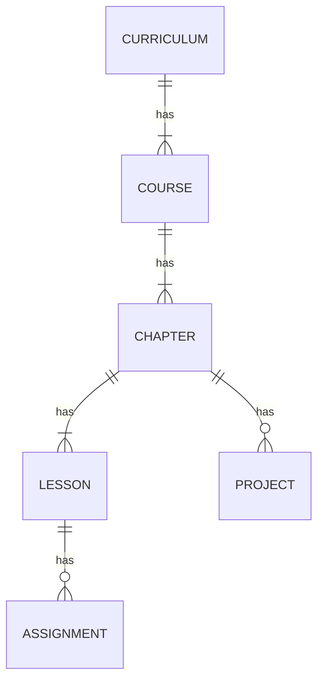

 
In this post, I will share my experience with [The Odin Project (TOP) Full Stack JavaScript curriculum](https://www.theodinproject.com/paths/full-stack-javascript).  This post is a sequel to the [post](https://creme332.github.io/creamy-notes/posts/odin-foundations/) where I discussed my experience with the Foundations curriculum. 

> Keep in mind that my experience might not reflect the current state of the full stack JavaScript curriculum. Over time, there has likely been significant updates to the curriculum.
{: .prompt-warning }

## Context

I began the full stack JavaScript path on 1 September 2022 and at that time I had a lot of commitments which severely limited the amount of time that I could devote to it. For one, I was a computer science freshman and I had to work on assignments and prepare for exams. I was also working on side-projects such as [liGebra](https://github.com/creme332/liGebra) and [tizc](https://github.com/creme332/tizc) among others.

## JavaScript vs Ruby on Rails

After completing the Foundations course, TOP offered me the choice between full stack JavaScript and full stack Ruby on Rails. I chose the former for the following reasons:

1. Based on the [data that I collected](https://myjobviz.web.app/results) from the job market in my country and based on the Stack Overflow Developer Survey (2022), I deduced that JavaScript is more popular than Ruby and  would likely increase my job prospects.

_Programming, scripting, and markup languages from the Stack Overflow Developer Survey 2022_

2. I already had some knowledge of JavaScript from the Foundations course and wanted to use it to my advantage instead of having to learn a new programming language from scratch.
3. The Ruby curriculum involved a lot of command-line projects which I did not find appealing. I have worked on my fair share of command-line projects in C++ (e.g., [ligebra](https://github.com/creme332/liGebra), [flappy bird](https://github.com/creme332/ai-flappy-bird)) in the past and I wanted a new experience. 

## Curriculum structure

The curriculum at the time was structured as follows:

| Course                    | Number of lessons | Number of projects | What you learn                                                             |
| ------------------------- | ----------------- | ------------------ | -------------------------------------------------------------------------- |
| Intermediate HTML and CSS | 22                | 2                  | Concepts such as SVG, emmets, forms, CSS Grid, CSS Flexbox, and much more. |
| JavaScript                | 37                | 16                 | How to build dynamic and interactive websites.                             |
| Advanced HTML and CSS     | 15                | 1                  | CSS animations, accessibility, and responsive design.                      |
| React                     | 23                | 3                  | How to use the React library.                                              |
| NodeJS                    | 20                | 7                  | Backend development with Express and MongoDB.                              |
| Getting Hired             | 12                | 0                  | General information on job finding, interviews, internship, and career.     |

It followed the same format as the Foundations course:
- Each course consists of multiple chapters and each chapter consists of multiple lessons.
- Each lesson usually has an assignment.
- There is at least 1 project per chapter.

## Curriculum quality
 Some key features of the curriculum are:

- **Self-paced**: There are no deadlines for the lessons, assignments or projects. This was a huge advantage for me because I was also able to customize my learning experience to suit my needs: I was able to skim rapidly over material I was already familiar with, and spend extra time on implementing challenging features in my projects. 
- **Project-based learning approach**: By the end of the curriculum, I completed over 20 projects, many of which are resume-worthy. These projects were essential in consolidating my knowledge of web development because I tend to pay less attention to the lessons.
- **Solid foundations**: The curriculum takes its time to cover the fundamentals thoroughly. By ensuring a solid foundation in essential concepts like ES6, module bundling with webpack, and project structuring upfront, it sets a strong groundwork for later understanding libraries like React. This gradual progression allows for a deeper comprehension and smoother transition between lessons.
- **Wide range of learning resources**: The resources used by TOP have both breadth and depth. They include documentation, blog articles, videos, and interactive exercises, with my favorite ones being [CSS Grid Garden](https://cssgridgarden.com/) and [Flexbox Froggy](https://flexboxfroggy.com/).

One caveat of the curriculum is that it can change at any time. The changes can range from minor lessons updates to an entire course overhaul. These changes can be annoying for two reasons:

1. If you are in the middle of a project and that project gets removed from the curriculum, you will lose access to the project page from their website. This scenario actually happened to me when I was working on the capstone project (formerly titled "JavaScript Final Project") for the JavaScript course. Since I had already started the project and was too far ahead, I was compelled to complete it. Fortunately, TOP is open-source and I could have searched for the old project page from their github repository despite the inconvenience.
2. The TOP website marks your previously completed course as incomplete and resets your progress for that particular course. In my case the React course and the Getting Hired courses were completely revamped after I was done with it and I lost my progress on the React course:

_My progress for the React course was undone_

While most of the learning resources recommended by the curriculum were easy to understand, at times I encountered resources which were not beginner-friendly at all. One such example is the [`You Don't Know JS`](https://github.com/getify/You-Dont-Know-JS) book recommended in the JavaScript course. Despite my attempts at reading some sections of the book, I could not grasp much because it was too convoluted.  

## My strategy 

While going through the curriculum, I adopted a few strategies:

- **Work simultaneously on projects and lessons**: I often found myself spending too much time on the projects. To counteract this, I would delve into upcoming lessons even though I was not done with the previous projects to restrict the amount of time that I had to work on projects.
- **Skim through familiar lessons**: I spent very little time on topics which I was already familiar with. For example, I managed to complete all the lessons on the Accessibility and Responsive Design course in 2-3 days. 
- **Use online sandboxes**:  Sandboxes like CodePen and CodeSandbox can be used to do some assignments (like the ones from the data structures and algorithms course) quickly. They require no setup on your part and you start writing code straight away. You can find some of my assignments on my [Codepen profile](https://codepen.io/creme332/pens/showcase).
- **Take breaks**: I took several breaks from TOP to focus on other things and to recharge. The breaks lasted at most 3 months.

## Statistics

- I dedicated nearly 1.5 years to this curriculum. I started the full stack curriculum on 1 September 2022 and completed everything (except the last 2 projects) by 16 January 2024.
- I spent a median time of 2 weeks on the full stack projects.
- The projects took around 1300 commits.

### Time spent per project

Here's a summary of the amount of time I spent on some of my projects in reverse chronological order:

| Project                                                                               | Days spent |
| ------------------------------------------------------------------------------------- | ---------- |
| [Members Only](https://art98.vercel.app/)                                             | 17         |
| [Personal Portfolio](https://creme332.vercel.app/)                                    | 13         |
| [Inventory Application](https://invent0.web.app/)                                     | 19         |
| [Where’s Waldo (A Photo Tagging App)](https://enigma69.web.app/)                      | 25         |
| [Shopping Cart](https://creme332.github.io/my-odin-projects/shopping-cart/build)      | 30         |
| [Memory Card](https://creme332.github.io/my-odin-projects/memory-card/build)          | 10         |
| [Weather App](https://creme332.github.io/my-odin-projects/weather-app/dist/)          | 4          |
| [Todo List](https://creme332.github.io/my-odin-projects/todo-list/dist/)              | 8          |
| [Restaurant Page ](https://creme332.github.io/my-odin-projects/restaurant-page/dist/) | 5          |
| [Tic Tac Toe ](https://creme332.github.io/my-odin-projects/tic-tac-toe/)              | 5          |
| [Library](https://github.com/creme332/my-odin-projects/tree/main/library)             | 2          |
| [Admin Dashboard ](https://creme332.github.io/my-odin-projects/admin-dashboard/)      | 3          |
| [Sign-up Form](https://creme332.github.io/my-odin-projects/sign-up-form/)             | 2          |

The above numbers are reflect the number of **consecutive** days between the start of the project and its completion date and on some days I managed to put in 10 hours of work. 

### Code frequency

The code frequency graph for the `my-odin-projects` repository is shown below. Keep in mind that this monorepo does not contain all the full stack projects that I worked on:

_Code frequency graph from my github monorepo_

## Why I skipped the last 2 projects

Technically I have not completed the entire curriculum: I only completed all the lessons and skipped the last 2 projects. After completing all the lessons in the curriculum, I did not want to spend another 1-2 months on the last two projects (Messaging App and Odin-book) due to a lack of time and motivation. Honestly, I did not find these projects particularly interesting because I did not have any original ideas for these projects. I always try to add some unique twist to my projects to spice things up. Here are some examples when I transformed a boring project from TOP into a more interesting one:

- [Rock Paper Scissors](https://creme332.github.io/my-odin-projects/rps-game/): I implemented a fighting style game where players throw either rock, paper, or scissors.
- [Calculator](https://creme332.github.io/abacusLite/): I implemented an interactive abacus instead of the boring digital calculator.
- [Tic Tac Toe](https://creme332.github.io/my-odin-projects/tic-tac-toe/): I implemented a 3D version of Tic Tac Toe instead of the usual 2D one.

## Why I chose a monorepo initially for my projects

When I first started with the foundations course, I chose to place all my projects in a single repository as opposed to one repository per project because I did not want to clutter my github repository list with mini-projects. Moreover, an all-in-one approach would make it easier for other people to browse through all my projects at once.

However, as I moved on to the later stages of the curriculum, I realized that it would be better to create separate repositories for the full-stack projects. The full stack projects are quite bulky on their own and placing them in separate repositories also made deployments on SaaS services much easier. Another disadvantage of the monorepo approach is that its size (currently at 600MB)  probably discouraged a lot of people who wanted to try out some projects from cloning it. 

## Useful resources

Here's a list of non-exhaustive resources that I used while working on the curriculum:

| Resource                                                       | Purpose                                                                                                    |
| -------------------------------------------------------------- | ---------------------------------------------------------------------------------------------------------- |
| [GoFullPage](https://gofullpage.com/) Chrome Extension         | To take full page screenshots of my projects for the README.                                               |
| [Excalidraw](https://excalidraw.com/)                          | For wireframing                                                                                            |
| [ScreenToGif](https://www.screentogif.com/)                    | To record GIFs of my projects for the project README.                                                      |
| [ezgif](https://ezgif.com/)                                    | An online tool for editing GIFs. I mainly used it for speeding up my GIFs.                                 |
| [Markdown badges](https://github.com/Ileriayo/markdown-badges) | Badges for your README.                                                                                    |
| [Frontend Checklist](https://frontendchecklist.io/)            | An exhaustive list of all elements you need to have / to test before launching your website to production. |
| Chrome DevTools Lighthouse                                     | For analyzing website accessibility, performance, and SEO.                                                 |

## Conclusion

_Charting the Course Ahead (Sommer, 2014)_

The Full Stack JavaScript curriculum was very challenging to do and I also feel guilty for not completing the last 2 projects. However, I feel like I have learnt enough from the TOP curriculum and it is now time for me to move on to other things. I would highly recommend the Full Stack JavaScript curriculum to anyone wanting to get started with full stack web development.  

## References

1. The Odin Project, 2024. Full Stack JavaScript [online]. Available at: [https://www.theodinproject.com/paths/full-stack-javascript](https://www.theodinproject.com/paths/full-stack-javascript) [Accessed on 06 May 2024].
2. Stack Overflow, 2022. Most popular technologies: Programming, scripting, and markup languages  [online]. Available at: [https://survey.stackoverflow.co/2022#programming-scripting-and-markup-languages](https://survey.stackoverflow.co/2022#programming-scripting-and-markup-languages) [Accessed on 04 May 2024].
3. Sommer, M., 2014. The Open Road Location: Minden Nevada BLM District: Carson City. Photograph. Available at: [https://commons.wikimedia.org/wiki/File:The_Open_Road_%2819982587021%29.jpg](https://commons.wikimedia.org/wiki/File:The_Open_Road_%2819982587021%29.jpg) [Accessed on 06 May 2024].

