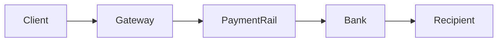
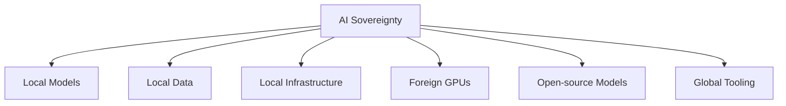
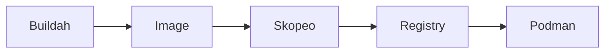

I attended DevCon 2026, the biggest tech conference in Mauritius, from 23-25 July. Unlike last year, I was able to attend all three days, which meant attending over 10 talks. This was also the first tech conference that I attended as a full-stack developer, since I was still a student last year. In this post, I will summarize everything that I learnt (and still remember) over the course of the past three days.

This year, I will not be using any rating system to rate the talks like I did in [my last post on DevCon](). Honestly, all talks have value and their own merits if you are able to focus on the right things.

## Talks I Attended

### 1. The Safe and Fast Future of Programming: Introducing Rust

> **Speaker**: Alex Bissessur
> 
> **Role**: Kubernetes Specialist @ La Sentinelle
{: .prompt-tip }

The first talk I attended was an introductory session to Rust. This talk was quite relevant for me because I have been using Rust at work for the past 6 months for developing microservices. It was insightful to have a refresher on the fundamentals of Rust. This was also the first Rust-related talk I attended at DevCon.

One exercise that Alex had trouble solving after a question from the audience was changing the value of `word` in the `modify_word` function:
```rust
fn modify_word(word: String) -> String {
    // TODO: change value of word to james
}

fn main() {
    let my_word = String::from("test");
    let received_word = modify_word(my_word);

    println!("{}", received_word); // expect "james"
}
```

Some of the possible solutions are:

```rust
fn modify_word(mut word: String) -> String {
    word = String::from("james");
    word
}

fn modify_word(mut word: String) -> String {
    word.clear();
    word.push_str("james");
    word
}
```

The first solution replaces the local String with a new one, while the second reuses the existing allocation by clearing and appending to it.

I also learned about the existence of Cot, a Rust framework for web development. According to Alex, if you have a Laravel background, the syntax of Cot will feel familiar. I have only used the Actix-web framework so seeing a different way of doing things with Cot was eye-opening. A downside of Cot, in my opinion, was its slow compilation times as I definitely felt like it was much slower than Actix-web in terms of cold compilation times. Another downside Alex mentioned in the talk, and in his [blog](https://alexbissessur.dev/cot-a-web-framework-for-rust/), was that Cot was not production-ready. However, the [Cot documentation](https://cot.rs/) now indicates that the framework is considered production-ready. 

Moreover, Alex introduced me to `bacon` when he used `bacon run` to run his Cot project. While I initially thought `bacon` was a basic wrapper around `cargo run`, I later discovered its unique feature by reading the documentation: live-reloading. Unlike `cargo-watch`, `bacon` is still maintained and reloads when code from a linked workspace is changed  (e.g. your server imports from a cargo workspace found in a different directory). `bacon` is a game-changer and I have started using it at work.

Finally, I discovered a new CLI tool called [Oha](https://github.com/hatoo/oha) for stress testing servers. It sends requests to an HTTP endpoint of your server, measures the response times, and displays real-time statistics in your terminal. Alex used it to compare the performance of two web servers, one built with Rust and another in Laravel. This is definitely a new tool that I will be adding to my arsenal.

> **Recommended Resources:**
> 
> - [Rustlings](https://rustlings.rust-lang.org/)
> - [The Rust Book](https://doc.rust-lang.org/book/)
> - [cot.rs](https://cot.rs/)
> - [bacon](https://dystroy.org/bacon/)
> - [Oha](https://github.com/hatoo/oha)

### 2. Essential Linux Skills for Google Cloud Platform

> **Speaker**: Ish Sookun
> 
> **Role**: Head of Systems & Architecture @ La Sentinelle
{: .prompt-tip }

In this talk, Ish covered the Linux skills you need to become a good DevOps engineer, with a focus on Google Cloud. Since I already had a background in networking, I mostly jotted down the things I didn't already know. My main takeaways from this talk are:

- Pluggable Authentication Modules (PAM). It provides shared libraries which other applications such as `su`, `passwd`, and `sshd`  can use for user authentication and authorization. You can read more about it from [https://www.group-ib.com/blog/pluggable-authentication-module/](https://www.group-ib.com/blog/pluggable-authentication-module/). According to Ish, understanding PAM will differentiate you from the average DevOps guy that only knows SSH for authentication.
- Cron is gradually being replaced by systemd timers on many modern Linux distributions, although systemd timers are more complex.
- You need to know how to resize a VM without downtime. In the past, this was a hard task but nowadays things have evolved. There were 3 commands that Ish gave for resizing Google Cloud VMs but I don't remember them.
- One tip that he gave for Linux exams was to learn to use the manual page in the terminal. For example with `man whoami`, you can view what the `whoami` command does, along with any available options and their descriptions.

### 3. Making an API for building APIs

> **Speaker**: Kishan Takoordyal
> 
> **Role**: Infrastructure and Support Team Leader @ Esokia
{: .prompt-tip }

This talk was about [Kinesis API](https://api.kinesis.world), a project that Kishan worked on for a few years. In a nutshell, it is a no-code platform for building APIs. It was a bit confusing at first to grasp what the project was about as he dove into the technical details way too early. I would have preferred seeing a demo of the project at the very beginning to understand its purpose.

The project consists of two main components:

1. **EngineX**: The full-stack application used to build APIs.
2. **Kinesis DB**: A custom-made database built on top of SQLite. It was inspiring to see that he built his own ACID-compliant database in Rust. 

While it is impressive to see someone writing an ACID-compliant database from scratch, especially in Rust, I am not entirely convinced by this design decision. Modern databases such as PostgreSQL are already battle-tested and the Kinesis DB does not seem to offer anything in return. Perhaps there are design goals that were not covered during the presentation.

It is also unclear what types of APIs you can build with Kinesis API. The website and his presentation only showcased a blog post manager. Can I for example use this tool to build a REST API for any project?

Based on what was presented during the talk and what I saw on the Kinesis website, I would not consider this project to be production-ready. While the idea is interesting, there are several challenges that will make it hard for people to adopt it:

1. Without a way to inject custom business logic, many real-world APIs would be difficult to implement.
2. The API does not seem to support file attachments. What if a request to the API needs to support `multipart/form-data`?
3. It is unclear whether it is possible to create database indexes from the GUI or is this handled automatically.
4. I could not find much information regarding security practices or independent audits.

> **Recommended Resources:**
> 
> - [Link to slides for this talk](https://ik.imagekit.io/konnect/Slides/Kinesis_API_Presentation_DevCon_2026.pdf)
> - [Github repository for Kinesis DB](https://github.com/EdgeKing810/kinesis-db)

### 4. Engineering Challenges of Paying People Across 160+ Countries

> **Speaker**: Avish Cheetaram
> 
> **Role**: Technical Support Engineer @ Papaya Global
{: .prompt-tip }

This was the last talk I attended on the first day of DevCon 2026, but it was probably the most information-packed talk of that day on fintech. 

I heard about the term "payment rail" for the first time and after looking it up afterwards it was easy to confuse it with a payment gateway. However, the distinction is as follows:

> While payment rails move money, payment gateways are the technology that lets businesses access those rails. Examples of payment rails are card networks (Visa, Mastercard), SEPA, and ACH.
> 
> 
> Source: [Stripe](https://stripe.com/resources/more/what-are-payment-rails)



Some of the engineering challenges of paying people across different countries are:

1. Cutoff time, file formats, API of payment rails
2. **Duplicate payment requests**: Duplicate payments are worse than failed payments. The solution is to use idempotency keys: a unique key is generated by the client with an expiration date and this key is attached to the HTTP header of the request. The backend stores the idempotency key (along with the result of the first request). If another request arrives with the same key, it returns the previous result instead of processing the payment again. You can read more about it at this [post by ByteByteGo](https://bytebytego.com/guides/how-to-avoid-double-payment/).
    ```mermaid

    sequenceDiagram
        participant Client
        participant API

        Client->>API: POST /payments (Key=abc123)
        API-->>Client: Payment Created

        Client->>API: Retry (Key=abc123)
        API-->>Client: Return previous response
    ```
3. How to implement transactions that span services in a microservice architecture? The issue is that each microservice has its own database and we cannot use a local ACID transaction. The Saga pattern is one possible solution. I recommend reading about it in this post by [Microservices.io](https://microservices.io/patterns/data/saga.html) and this one by [Microsoft](https://learn.microsoft.com/en-us/azure/architecture/patterns/saga). 
4. **Time**: If we want recipient to receive payment at a specific date and time, we need to consider banking holidays, weekends, daylight saving, settlement windows, etc.
5. **Data type of currency**: Floating points should never be used due to rounding errors. Instead, store the amount as an integer representing the smallest unit. For example, 121.457 can be stored as 121457 with a scale of 3 decimal places. The integer type should be large enough for the expected range of values.

### 5. Panel Discussion — Sovereign by Design: Building Africa's Data, Cloud and AI Future

On the second day of the conference, I attended the last twenty minutes of a panel discussion on data sovereignty. This panel featured Naveesh Doolhur, the Head of AI of Mauritius Telecom, and Dylan Harbour, Director of Technology at Ringier SA. One of the ideas discussed was that each African country should build their own AI models because existing foundation models often lack sufficient training data for local languages, culture, and regional knowledge. Mauritius Telecom has already started buying GPUs and plans to create its own open-source model soon for all Mauritians to use.

One interesting critique to this panel, as raised by an audience member, was whether AI sovereignty is even achievable. As the saying goes, no man is an island, and at the end of the day no country is going to build everything from scratch. We are still going to buy GPUs from other countries, maybe use a base model from another country to start fine-tuning, and rely on software and tooling developed elsewhere. The Mauritius Telecom representative agreed with the sentiment and said that it is a trade-off but it is still necessary to start somewhere.



### 6. Beyond Docker: Mastering Container Workflows with Podman, Skopeo & Buildah

> **Speaker**: Om Gokhool
> 
> **Role**: Lecturer, Consultant
{: .prompt-tip }

This talk by Om was about Podman, a Docker alternative. I had heard of Podman before but never had the chance to try it out since Docker always got the job done. Key takeaways:

- A Docker container is NOT a virtual machine. A VM emulates a physical machine while a Docker container emulates part of the OS where user processes run. A detailed guide on the differences between Docker containers and virtual machines can be found [here](https://aws.amazon.com/compare/the-difference-between-docker-vm/).
- LXC stands for Linux Containers and is a virtualization technology that predates Docker. Docker originally relied on LXC but later introduced its own container runtime. LXC performs virtualization at the OS-level. You will typically use it when you are running Linux-only services for high performance. Read more details [here](https://forums.lawrencesystems.com/t/virtual-machines-vs-lxc-system-containers-vs-docker/26497).
- The Docker daemon (`dockerd`), runs as root. Since `dockerd` typically runs as root, compromising the daemon can have serious security implications. This becomes even more relevant as AI agents are increasingly granted access to container tooling.
- Podman runs rootless by design and has no daemon, offering security advantages over Docker's traditional setup. While it is possible to run Docker in rootless mode, most users are unaware of it and the complexity of setting it up makes it harder for people to adopt it.
- Docker is still preferred over Podman due to mass adoption and better support.
- Since Podman is a drop-in replacement for Docker, it supports Dockerfile.
- Docker has licensing limitations. Companies beyond a certain revenue need to pay for Docker license so that its employees can use it.
- The trio Podman, Skopeo and Buildah can achieve what Docker does. Skopeo is used for shipping containers, buildah is for building, and Podman is for running containers.
- Skopeo is a CLI tool that allows you to transfer container images between registries (e.g. from GitHub Container Registry to DockerHub) without a daemon or pulling the image locally first. This avoids downloading the image into the local container storage before pushing it elsewhere. This is made possible by streaming the image data from one registry to another.



### 7. The Execution Gap: Why Your AI Strategy Will Fail (And How to Build One That Won't)

> **Speaker**: Vincent Chu and Ketika Jhingoor
> 
> **Role**: Multi-cloud & AI architect, software engineer
{: .prompt-tip }

In this talk, the speakers first drew a parallel between the current AI hype and the [cloud computing hype](https://www.cloudcomputing-news.net/news/cloud-eight-years-later-inflated-expectations-enterprise-adoption/) that occurred decades ago. Many companies did not do their homework and migrated to the cloud at the cost of increased complexity, higher costs, and integration debt. The speakers then said that we should not fall prey to pressure from boards, CTOs, or vendors to buy into the latest hype. They then gave these 5 questions that we should be asking ourselves before implementing a new AI strategy:

1. Outcome clarity: We need clear outcomes
2. Data readiness: Do we have the right data?
3. Operating muscle: How to execute AI strategy?
4. Failure protocol: Based on what criteria can we say that the AI strategy has succeeded or failed?
5. Kill criterion: How do we stop the strategy? Is there a kill switch?

I wonder how applicable this framework is in startups because startups tend to have this move-fast and fail-faster motto. Spending significant time on data readiness and failure protocols may slow experimentation, although it could also prevent investing heavily in AI initiatives that were never viable in the first place.

### 8. Claude Better: Months of Learnings in Minutes

> **Speaker**: Dylan Harbour
> 
> **Role**: Director of Technology @ Ringier SA
{: .prompt-tip }

I only attended the last 15 minutes of this talk because I arrived late, but I was able to grab some gold nuggets of knowledge:

- Recommended people to follow according to Dylan: Dex Horthy, Matt Pocock, AI Engineer, The AI Daily Brief
- Avoid AI hype and politics
- For individual developers, a subscription plan is often easier to budget than pay-per-token API billing.
- In a Claude Code conversation, Double-tap `Esc` to jump back and branch a session.
- Use the `claude setup-token` command to generate a Claude OAuth token that you can use in a CI pipeline. It uses your plan subscription and does not require API billing.
- Claude Code has a 5-hour rolling window and with proper timing you can fit several windows within your 9-hour workday.

### 9. Architecting AI-Powered Enterprise Systems in .NET

> **Speaker**: Yash Busawon
> 
> **Role**: Software Developer @ Infomil
{: .prompt-tip }

For the final talk that on the second day of the conference, I attended a talk on the architectural decisions in enterprise systems with AI features. The checklist provided by Yash was:

- [ ] Clear business owner and success metric
- [ ] Output is structured and validated
- [ ] RAG respects authorization
- [ ] Logs/traces include prompt/model version
- [ ] Human review for risky actions
- [ ] Prompt and schema versioning
- [ ] Define how to handle sensitive data
- [ ] Timeouts, retries, and fallbacks
- [ ] Evaluation and dataset exists
- [ ] Cost and rate limits monitored

For me, the transformative part was the prompt and model versioning part. This is something that can be easily overlooked but can have massive consequences: small changes in a prompt can drastically affect the output of a model. Without versioning, it becomes difficult to reproduce model behavior or determine whether a regression was caused by a prompt change, a model upgrade, or an application change.

Additionally, to elaborate on Point 3, when using RAG we need to ensure that users can only retrieve documents that they are authorized to access.

### 10. Powering Modern Warfare — Palantir Foundry

> **Speaker**: Aditya Bholah
> 
> **Role**: Data Engineer @ Ringier AG (Delphi)
{: .prompt-tip }

Aditya talked about Palantir Foundry, an online low-code platform for performing data analysis using Palantir's infrastructure. Palantir is an American software company that develops software for defense and commercial companies. Putting aside Palantir's controversies regarding mass surveillance and AI weapons for wars, this talk was quite insightful:

- Palantir Foundry is based on PySpark, an open-source Python API for Apache Spark which is used for big data analytics.
- The steps for data analysis on Palantir Foundry are Ingest, Transform, Ontology, App, Decision.
    ```mermaid
    flowchart LR
        Ingest --> Transform
        Transform --> Ontology
        Ontology --> Apps
        Apps --> Decisions
    ```
- One of the key features of Palantir Foundry is Ontology which allows you to create business objects from data and perform actions on them.
- You can also enforce column-level permissions for objects. Maybe some people in your team should not see a particular column of a dataset.
- Palantir Foundry is not free for commercial use and is not available in Mauritius yet. In other countries, you are able to create a Developer account for free to try out the features.
- Since you need to upload your dataset to Palantir, there can be privacy concerns. According to Aditya, to be on the safe side, in your enterprise contract with Palantir, you need to specify specific clauses to address this.
- Aditya claims that Palantir Foundry, together with its AI features, made him much more efficient at his work.

## Conclusion

I was overwhelmed (in a good way) by the amount of information packed into the conference. This conference, just like the previous year, was a must-attend, especially for those early in their tech careers. It will give you the chance to interact with professionals on a wide range of topics and you will definitely learn a lot if you go in with an open mind and set aside your ego.