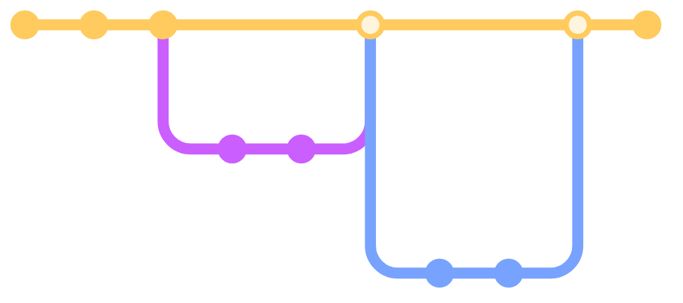

---
# the default layout is 'page'
icon: fas fa-info-circle
order: 4
mermaid: true
---

I'm creme332, an undergraduate student studying computer science in Mauritius. This blog is a digital diary where I share my experiences and document my thoughts while working on projects. What drives me is the constant evolution and innovation happening every day in this field, and I enjoy exploring new ways to apply my skills.

Feel free to reach out to me at c34560814 [at] gmail [dot] com if you have any queries.

Stay up-to-date with my latest posts by subscribing to my [RSS feed](/feed.xml).

